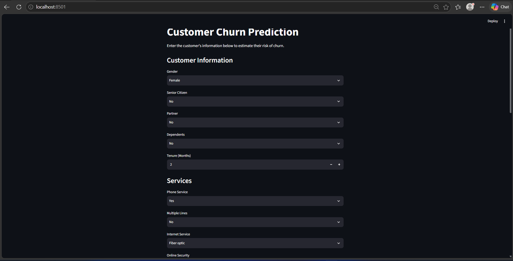
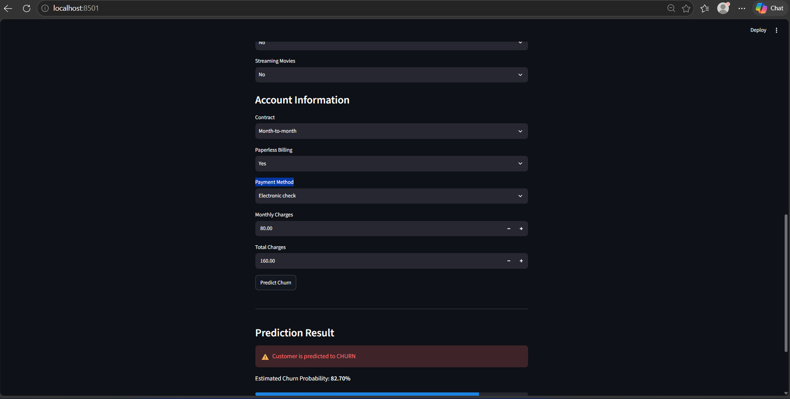

# Customer Churn Prediction

## Project Overview

This project uses machine learning to predict whether a customer
is likely to churn based on customer demographics, services,
contract details, and billing information.

## Dataset

IBM Telco Customer Churn dataset.

## Technologies Used

- Python
- Pandas
- Scikit-learn
- Streamlit
- Joblib
- Jupyter Notebook

## Machine Learning Models

- Logistic Regression
- Decision Tree
- Random Forest
- Tuned Random Forest

## Final Model

The Tuned Random Forest was selected for deployment because
the project prioritizes identifying customers at risk of churn.

- Accuracy: 72.42%
- Precision: 48.86%
- Recall: 80.48%
- F1 Score: 60.81%
- ROC-AUC: 0.8356

## Streamlit Application

### Application Interface



### Prediction Result



## Project Structure

customer-churn-prediction/
│
├── data/
├── images/
├── model/
├── notebooks/
├── app.py
├── requirements.txt
└── README.md

## How to Run

```bash
pip install -r requirements.txt
streamlit run app.py

